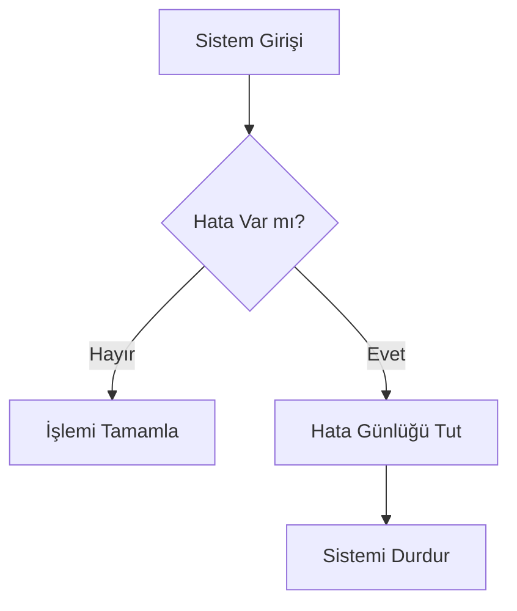

## 1. Merkezi Yapılandırma ve Meta Veriler

Sitenin global ayarları ve yazar bilgileri **`_config.yml`** dosyasında tutulur. Postlarınızı oluştururken bu yapıdan yararlanmalısınız.

### 1.1 Front Matter Alanları (Post Metadata)

Her yazının başında yer alan Front Matter (YAML blok) sitenin ilgili post hakkında bilgi edinmesini sağlar.

| Alan Adı        | Tip    | Zorunluluk | Açıklama                                                    |
| :-------------- | :----- | :--------- | :---------------------------------------------------------- |
| `title`         | String | EVET       | Yazının ana başlığı.                                        |
| `subtitle`      | String | HAYIR      | Başlık altındaki kısa açıklama.                             |
| `excerpt`       | String | EVET       | Sosyal medya ve listeler için kullanılan 1-2 cümlelik özet. |
| `date`          | Tarih  | EVET       | Yayınlanma tarihi.                                          |
| `categories`    | Dizi   | EVET       | Hiyerarşi için kullanılır: `[Ana Kategori, Alt Kategori]`.  |
| `tags`          | Dizi   | EVET       | Etiketler (küçük harfle yazılmalıdır).                      |
| `level`         | String | HAYIR      | Notun zorluk seviyesi (örn: Başlangıç, İleri).              |
| `related_posts` | Dizi   | HAYIR      | Sidebar'da listelenecek ilgili diğer postlar.               |

### 1.2 Otomatik Hesaplanan Bilgiler

Bu bilgiler Layout dosyasında otomatik olarak hesaplanır ve **Front Matter'a yazmanıza gerek yoktur**:

* **Yazar:** `_config.yml`'den gelir.
* **Okuma Süresi:** İçerik kelime sayısına göre (`~200 wpm` varsayımıyla) dinamik olarak hesaplanır.
* **Kategori Listeleme:** Sayım ve listeler, `categories` alanınıza göre otomatik olarak oluşturulur.

---

## 2. İçerik ve Özel Markdown Yapıları

Kodun ve özel notların doğru görünmesi için aşağıdaki Markdown formatlarını kullanın.

### 2.1 Kod Blokları (Syntax Highlighting & Kopyalama)

Uzun kodları veya çok satırlı yapıları göstermek için üçlü backtick (\```) kullanın. Dil adını belirtmek, hem renklendirmeyi hem de başlığı otomatik olarak oluşturur.


```ruby
# Ruby'de bir koşullu ifade örneği
if hava == "yağmurlu"
  puts "Şemsiye al."
end
```

Nasıl Çalışır? JavaScript, highlighter-rouge çıktısını yakalar, Ruby etiketini başlığa yerleştirir ve sağ üst köşeye kopyalama butonu ekler.

### 2.2 Metin İçi Kod (Inline Code) ve Kopyalama
Bir paragraf içinde tek bir komutu veya anahtar kelimeyi vurgulamak için tek backtick ( ) kullanın.

puts kendisine verilen veriyi yazdırır. Bu ifadeye tıkladığınızda, geçici bir geri bildirim ile kopyalama işlemi gerçekleşir.

Nasıl Çalışır? Tüm `<code>` elementleri CSS ile stilize edilir ve JavaScript ile tıklanabilir kopyalama özelliği eklenir.

### 2.3 Özel Uyarı Kutuları (Admonitions)
Metin içinde görsel olarak dikkat çekmek veya ipucu vermek için > (blockquote) yapısını kullanın ve başlığı büyük harflerle yazın. JavaScript, bu başlık metnini okuyarak yerine renkli bir ikon yerleştirir.


1. Kırmızı Tema (Kritik Uyarı/Hata)

> **DİKKAT!**
> Integer bölme sırasında ondalık kısmı kaybedersiniz. Bu durum hatalı sonuçlara yol açabilir.

2. Yeşil Tema (İpuçları/Başarı)

> **İPUCU!**
> Kod okunaklığını artırmak için, kısa koşullu ifadelerde `if` ifadesini sona yazın (Modifier Form).

3. Mavi Tema (Genel Bilgi)

> **BİLGİ!**
> Jekyll, Ruby ile yazılmış statik bir site üretecidir.

4. Sarı Tema (Önemli Vurgu)

> **ÖNEMLİ!**
> 'bundle install' komutunu çalıştırmadan önce `Gemfile` dosyasını kontrol edin.

5. Özel Alıntılar (Quote Blocks)

    Kramdown'da alıntıları belirtmek için QUOTE anahtar kelimesini kullanın. CSS, otomatik olarak büyük tırnak ikonu ekler.

> **ALINTI** "Basit, karmaşıktan daha iyidir. Karmaşık, içice geçmişten daha iyidir." - Python Zen'i

### 2.4 Hiyerarşik Şemalar ve Renklendirme (Mermaid)

Sistem mimarilerini veya süreç akışlarını görselleştirmek için Mermaid bloklarını kullanın. CSS dosyasındaki hazır sınıfları (class) kullanarak kutuları anlamlarına göre renklendirebilirsiniz.

**Kullanılabilir Renk Sınıfları:**
* `rootNode`: Ana başlıklar (Mavi)
* `warningNode`: Dikkat çekilmesi gereken adımlar (Sarı)
* `successNode`: Tamamlanan veya onaylanan süreçler (Yeşil)
* `errorNode`: Hata veya durdurma noktaları (Kırmızı)
* `infoNode`: Genel bilgilendirme kutuları (Açık Mavi)
* `leafNode`: Standart detay adımları (Koyu Kahve)

**Örnek Uygulama:**


## 3. SEO ve Yapılandırma İpuçları
robots.txt: Sitenizin kökünde mevcuttur ve tüm botlara tarama izni verir.

Sitemap: jekyll-sitemap gem'i ile sitemap.xml otomatik olarak oluşturulur.

Sosyal Medya: excerpt alanını doldurmak, Open Graph (Facebook/LinkedIn) ve Twitter Card önizlemelerinin doğru çalışmasını sağlar.