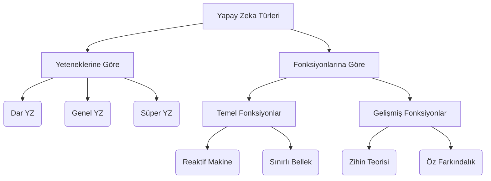

## Giriş

Yapay zeka, insan aklını taklit etmeyi sağlayan bir bilgisayar sistemidir diyebiliriz. Bir dizi **görevi** gerçekleştirmek için, veri üzerinden bir dizi karmaşık matematiksel modlleri ve algoritmaları kullanarak insan aklına benzeme yeteği sağar. Veriler yapay zekanın temelini oluşturu, ham maddesidir. Yapa zeka, sihirli bir çözüm olmadığını utumamak lazım. Yapay zeka otomasyon değildir.

## Tarihi Gelişimi

AI (Artificial Intellegence); en önemli gelişmesini Alan Turing tarafından, "Bilgisayar Makineleri ve Zeka" adlı eserinde başlatmıştır. Bu eser sonradan Turing Test haline geldi ve uzmanlar bilgisayar zekasını ölçmek için kullandı. Sinir ağlarının ilk  kavramı 1957 yılında Frank Rosenbaltt tarafından ortaya arıldı. 1958 yılında ise McCarthy, yapay zeka araştırmalı için terdih edilen programlama dili Lisp'i geliştirdi. 1959 yılında da Samual, satranç oynamak üzere programlan yazılım için "Makine Öğrenmesi" terimini kullandı. 1965 yılında Joseph Weizenbaum, **ELIZA** adlı etkileşimli bir program geliştirdi. 1995 yılında ise, ELIZA'dan esinlenerek geliştirilen **A.L.I.C.E** piyasaya çıktı. ALICE'yi ELIZA'dan ayıran şey ise doğal dil örnek veri toplama özelliğiydi. 1997 yılında ise Sepp Hochreiter ve Jürgen Schmidhuber, **RNN** ve **LSTM**'i geliştirdiler. 2011 yılında geldiğimizde IBM tarafından geliştirilen **WATSON** iki eski bilgi yarşıması şampiyonunu televizyon karşınıda yendi. Aynı yılda Apple **SIRI** asistanını pyasaya sürdü. 2015-201 yılında **ALPHAGO**, Go bir çok şampiyonu yenmeyi başardı. 2016 Yılında ise **SOPHIA** adlı ilk robat vatandaş geliştirilmiştir. 2018 yılında **TPU** olarak adlandırılan özel bir donamım tanıtıldı. 2020 yılında ise OpenAI, derin öğrenme kullanarak kod, şiir ve diğer dil ve yazı görevlerinden oluşan **GPT-3**'ü tanıttı. Bu noktadan sonta **LLM** olarak adlanmdırılan modellerde bir gelişim patlaması yaşanmaktadır. 

## Kullanım Alanları

- Sağlık
- Otonom Araç
- Bankacılık Finans
- Gözetim
- Sosyal Medya
- Eğlence
- Eğitim
- Uzay
- Oyun
- Robotik
- Tarım
- E-Ticaret

## Türleri

Günümüzde kullanılan yapay zeka modllerine **Dar Yapay Zeka** diyebiliriz. Örneğin; sesli asistanlar, görünütü tanıma sistemleri vb. **Genel Yapay Zeka** ise insanlar ile karşılaştıralabilir geniş bir görev yelpazesini yerine getirebilir anlamı taşımaktadır. GYZ, akıl yürütebilmeli, öğrenebilmeli, bilişsel yetenekleri geliştirebilmeli. Yani kendi kendine öğrenebilme, hayal edebilme gibi insana özgü olan özniteliklere sahip olanmalı. **Süper Yapay Zeka** ise insanlığın da ötesine geçmesi anlamı taşımaktadır. 

**Reaktif Makine** ise belleği ve verisi olmayan bir araçtır. Sadece belirli bir alanda üzmanlaştırılar, satranç oyununda rakibini yenmek, makline hamlelerini gözlemletyerek kazanmak olarak ifade edilebilir. **Sınırlı Bellek** ise önceki verileri toplar, belleğe ekler, doğru kararlar vermek için yeterli bellek ve donanıma sahip ama gelişmiş değil. Örneğin toplanan verilere göre restoran tavsiye edebilirler. **Zihin Teorisi** ise yapay zekanın düşüce ve  duyguları anlayabilecek ve sosyal olarak insanlara iletişime geçebilecek bir makine tasfir edilir. **Özfarkındalık** ise SYZ fonksiyonal karşılığı olarak düşünülmelidir.

Dar YZ ile Reaktif Makine ve Sınırlı bellek eşleştirilebilir. GYZ ve SYZ'lar ile de Öz Farkınmdalık ve Zihin Teorisi eşleştirilebilir.

## Alt Dalları

- Makine Öğrenmesi
- Derin Öğrenme
- Sinir Ağları
- Doğal Dil İşleme
- Uzman Sistem
- Bulanık Mantık
- Robotik
- Bilgisayarlı Görü
- Bilişsel Bilişim

## Temel Kavramlar

>**CAPTION**  Temel Kavramlar (^İlgili Notlardaki Eğitimden Alınmıştır)

Yapay zeka görselde görüldüğü gibi veri bilimi ve alt dalları ile içi içece bir sistemin bütünüdür.