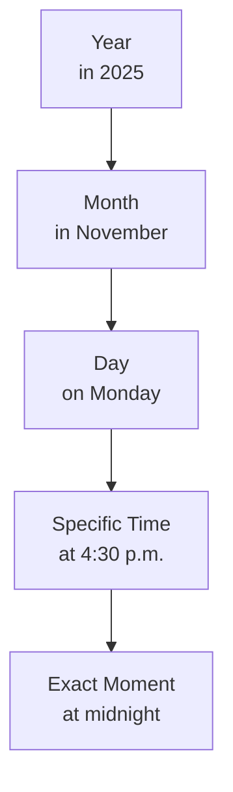

## Başlarken

Bu dil serisi ile beraber BTK akadiden takip ettiğim ingilizce dersinden aldığım notları işleyeceğim. 

## Be Fiili

Be fiili ingilizce de olmak anlamlamında kullanılan fiildir. Bu fiili geniş zamanda kullanımı "Ben mühendisim." gibi anlamlar katmaktadır. "Be" fiili kişi çekimlerine göre değişmektedir.

| Kişi            | Çekim                       |
| --------------- | --------------------------- |
| I               | <span class="gr">am</span>  |
| He / She / It   | <span class="gr">is</span>  |
| You / We / They | <span class="gr">are</span> |

Bu fiil peşine isimler almaktadır. Örneğin; aşçı(chef), doktor(doctor), dil(language), hayvan(animal), aslan (leon), Selçuk vb. pek çok isim sıralaya biliriz. Örnek kullanım incelemek istersek.

```eng
I am Selçuk.
You are a doctor.
He is an engineer.
She is a nurse.
It is a leon.
We are student.
You are my classmates.
They are good neighbors.
```
**Olumsuz cümlede formu:** 

`Kişi + am / is / are not ('m not, isn't / 's not, aren't / 're not) + İsim(Noun)`

---

İngilizcede genel cümle yapısı;

`Özne(subject) + Yüklem(Verb) + Nesne(Object)`

<span class="gr">SVO</span> şeklindedir. Bu yapı korunduğu şekliyle genişleyecekti.

Daha detaylı anlatım sunmadan önce geniş zaman yapısını da inceleyelim.

## Geniş Zaman (Simple Present)

Geniş zaman, Türkçede genel gerçekleri, alışkanlşıkları, rutinleri ve değişmeyen durumları ifade etmede kullanılır. Bu türkçede `-r / -ar / -er` yapısında kullanılır. Yardımcı fiili ise **"Do / Does"dır**. 

| Kişi                | Çekim                        |
| ------------------- | ---------------------------- |
| I / You / We / They | <span class="gr">do</span>   |
| He / She / It       | <span class="gr">does</span> |

**Olumlu cümlede formu:** 

`Subject + Auxiliary Verb (Yardımcı fiil) + Verb`,

`Kişi + do / does + Fiil` 

> **ÖNEMLİ!** Geniş zamanda DO ve DOES yardımcı fiili olumlu cümlelerde düşer. Ayrıce does fiilindeki "<span class="gr">s</span>" eki fiile transfer edilir. Örneğin;
> 
> I wake up early every day.
> 
> She go<span class="gr">es</span> to school every weekday.

**Olumsuz cümlede formu:** 

`Kişi + do / does not (don't / doesn't) + Verb`

**Soru cümlede formu:** 

`Do / Does + Kişi + Verb ?`

---

**Örnek Cümlerler:**

```eng
I wake up early.
(Erken uyanırım.)

I drink coffee in the morning.
(Sabahları kahve içerim.)

You work hard.
(Çok çalışırsın.)

We study English every day.
(Her gün İngilizce çalışırız.)

They live in Ankara.
(Ankara’da yaşarlar.)

He goes to work at 9.
(O, işe 9’da gider.)

She likes music.
(O, müzik sever.)

He plays football on weekends.
(O, hafta sonları futbol oynar.)

She does not smoke.
(O, sigara içmez.)

Do you like tea?
(Çayı sever misin?)

```


**Be Fiili ile Örnek Cümlerler:**

```eng
I am a student.
(Ben bir öğrenciyim.)

I am at home.
(Evdeyim.)

You are my friend.
(Sen benim arkadaşımsın.)

You are very kind.
(Sen çok naziksin.)

He is a teacher.
(O bir öğretmen.)

She is tired today.
(O bugün yorgun.)

It is cold outside.
(Dışarısı soğuk.)

We are ready.
(Hazırız.)

They are happy now.
(Şu an mutlular.)

I am not busy.
(Meşgul değilim.)
```

---

**Örnek Paragraf:**

I am a student and I live in Ankara.
I am 22 years old and I am very interested in technology.
Every day, I wake up early and I study English at home.
My classes are in the morning, so I go to school at 9 o’clock.
My teachers are kind and my classmates are friendly.
After school, I usually study on my computer and I read simple English texts.
In the evening, I am tired but happy.
I do not work at night, and I go to bed early.
On weekends, I am at home and I spend time with my family.
I like learning English because it is important for my future.

---


## Kişi Zamirleri (Subject Pronouns)

| Zamir | Karşılığı          |
| ----- | ------------------ |
| I     | Ben                |
| You   | sen                |
| He    | O (Eril)           |
| She   | O (Dişil)          |
| It    | O (Cansız, Hayvan) |
| We    | Biz                |
| You   | Siz                |
| They  | Onlar              |


## Sıfatlarla Be Fiili

`Adjective(Sıfat) + Noun`

| Adjective | Noun  |
| --------- | ----- |
| nice      | car   |
| small     | town  |
| importent | books |
| good      | men   |
| tall      | tree  |
| old       | house |
| critical  | error |

**Örnekler:**
- I am <span class="gr">hard</span> working
- My sister is <span class="gr">young</span>
- Pets are <span class="gr">cute</span>
- This table is <span class="gr">raund</span>
- A scientist is <span class="gr">inteliligent</span>
- Teachers are <span class="gr">helpfull</span>

## Be Fiili ile Konum Bildirme

| Kelime     | Açıklamaı     |
| ---------- | ------------- |
| here       | burada        |
| there      | orada         |
| over there | tam orada     |
| inside     | içeride       |
| outside    | dışarıda      |
| upstairs   | üst katta     |
| downstairs | alt katta     |
| downtown   | şehir merkezi |

Bu liste yalın haliye kullanılabilir.

- `I'm here.`

| Kelime      | Açıklamaı               |
| ----------- | ----------------------- |
| in          | içinde                  |
| on          | üzerinde                |
| at          | -da / -de               |
| next to     | bitişiğinde             |
| beside      | yakınında / bitişiğinde |
| near        | yakınında               |
| inside      | içinde                  |
| outside     | dışında                 |
| above       | yukarısında / üstünde   |
| belowe      | aşağasında              |
| under       | altında                 |
| in front of | önünde                  |
| behind      | arkasında               |
| berween     | iki şey arasında        |

Bu listede sonuna işaret edebileceği kelimeler alır.

- `My father is in the library now.`
- `The post office is next to the bank.`


**Yaygın kullanımlar:**

- <span class="gr">in</span> Turkiye 
- <span class="gr">in</span> London
- <span class="gr">in</span> the house
- <span class="gr">at</span> home
- <span class="gr">at</span> work
- <span class="gr">at</span> the bus stop
- <span class="gr">on</span> the bus

## İyelik Sıfatları (Possasive Adjectives)

| Subject Pronouns | Possasive Adjectives | Açıklaması |
| ---------------- | -------------------- | ---------- |
| I                | My                   | Benim      |
| You              | Your                 | Senin      |
| He               | His                  | Onun       |
| She              | Her                  | Onun       |
| It               | Its                  | Onun       |
| We               | Our                  | Bizim      |
| You              | Your                 | Sizin      |
| They             | Their                | Onların    |

- `Those books are their books`

> **DİKKAT!** Bu taloda yer alan iyelik sıfatları tek başlarına kullanılamazlar. Her zaman;
>
> <span class="gr">My pen</span>
> 
> <span class="gr">Your sister</span>
>
> <span class="gr">His friends</span>
>
> <span class="gr">Her mother</span>
>
> <span class="gr">Its toy</span>
>
> <span class="gr">Our home</span>
>
> <span class="gr">Their books</span>
>
> vb. şekillerde kullanılırlar.

## İşaret Sıfatları

| Kelime | Anlamı         |
| ------ | -------------- |
| This   | Bu             |
| These  | Bunlar         |
| That   | Şu / O         |
| Those  | Şunlar / Onlar |

- `This book`
- `Bu kitap`
- `These books`
- `Bunlar kitap`
- `That book`
- `Şu kitap`
- `Those books`
- `Şunlar kitap`


> **CAPTION** İşaret Sıfatları [^1]

## Sayılar

| -       | -         | -        | -        | -       |
| ------- | --------- | -------- | -------- | ------- |
| one     | two       | three    | four     | five    |
| six     | seven     | eight    | nine     | ten     |
| eleven  | twelve    | thirteen | forteen  | fifteen |
| sixteen | seventeen | eighteen | nineteen | twenty  |


| -     | -       | -      | -      | -             |
| ----- | ------- | ------ | ------ | ------------- |
| ten   | twenty  | thirty | forty  | fifty         |
| sixty | seventy | eighty | ninety | a/one hundred |

| -          | -           | -                  | -            | -                    |
| ---------- | ----------- | ------------------ | ------------ | -------------------- |
| ten        | one hundred | one thousand       | ten thousand | one hundred thousand |
| one milion | ten milion  | one hundred milion | one billion  | one hundred billion  |


- `126 789 123 : One hundred twenty-six million seven hundred eighty-nine thousand one hundred twenty-three`


## Saatler

What time is it?

- 4:30  : It <span class="fl-blue">is</span></span> <span class="fl">half past four</span>
- 4:30  : It <span class="fl-blue">is</span> <span class="fl">four thirty</span>
- 3:15  : It<span class="fl-blue">'s</span> <span class="fl">quarter past three </span>
- 3:15  : It<span class="fl-blue">'s</span> <span class="fl">three fifteen</span>
- 5:45  : It <span class="fl-blue">is</span> <span class="fl">quarter to six</span>
- 5:45  : It<span class="fl-blue">'s</span> <span class="fl">five forty five</span>
- 9:28  : It <span class="fl-blue">is</span> <span class="fl">twenty eigth past nine</span>
- 9:28  : It <span class="fl-blue">is</span> <span class="fl">nine twenty eight</span>
- 11:57 : It <span class="fl-blue">is</span> <span class="fl">three to twelve</span>
- 11:57 : It <span class="fl-blue">is</span> <span class="fl">eleven fifty seven</span>

**What time do you get home?** -> <span class="fl">At</span> Nine <span class="fl-blue">p.m.</span>

Saat ifadeleri **at** ile kullanılır.

- A.M. : Öğlenen önce
- P.M. : Öğlenen Sonra

## Günler, Aylar , Yıl İfadeleri

### What day is it?

- It is Monday
- It is Tuesday
- It is Wednesday
- It is Thursday
- It is Friday
- It is Saturday
- It is Sunday

The release of the software is <span class="fl">on</span> Monday.

Gün ifadeleri **on** ile kullanılır.

### What month is it?

- It is January
- It is February
- It is March
- It is April
- It is May
- It is June
- It is July
- It is August
- It is September
- It is October
- It is November
- It is December

The midterm exams are <span class="fl">in</span> November.

Ay ifadeleri **in** ile kullanılır.

### What year is it?

Our graduation is <span class="fl">in</span> 2025.

Yıl ifadeleri **in** ile kullanılır.


Bu kullanımları incelediğimizde bir çizelge ile göstermek gerekirse;



## Sıra Sayıları

- $$1^{st}$$ : first
- $$2^{nd}$$ : second
- $$3^{rd}$$ : third
- $$4^{th}$$ : fourth
- $$5^{th}$$ : fifth
- $$10^{th}$$ : tenth
- $$11^{th}$$ : eleventh
- $$12^{th}$$ : twelfth
- $$13^{th}$$ : thirteenth
- $$14^{th}$$ : fourteenth
- $$15^{th}$$ : fifteenth
- $$20^{th}$$ : twentieth
- $$21^{st}$$ : twenty-first
- $$22^{nd}$$ : twenty-second
- $$23^{rd}$$ : twenty-third
- $$24^{th}$$ : twenty-fourth
- $$25^{th}$$ : twenty-fifth
- $$21^{st}$$ : twenty-first
- $$22^{nd}$$ : twenty-second
- $$23^{td}$$ : twenty-third
- $$31^{st}$$ : thirty-first

Sonu 1, 2, 3 ile bitenler özel (11, 12, 13 hariç).

> **BİLGİLENDİRME!** Eğer bir tarih içerisinde gün belirtilirse <span style="color: var(--primary-dark); font-weight: bold;">on</span> kullanılır.
>
> The stores are closed <span style="color: var(--primary-dark); font-weight: bold;">on</span> the $$1^{st}$$ of January.

## Sıklık Zarfları

| Kelime    | Anlamı             |
| --------- | ------------------ |
| Always    | Her zaman          |
| Usually   | Genellikle         |
| Often     | Sıklıkla / Sık sık |
| Sometimes | bazen              |
| Seldom    | Seyrek / nadiren   |
| Rearely   | Nadiren            |
| Never     | Asla               |

Cümlede yapısı;

`Özne + Yardımcı Fiil + Sıklık Zarfları + Fiil`

- I <span class="fl">always</span> wake up early.
- She <span class="fl">usually</span> drink<span class="gr">s</span> tea in the morning.
- He <span class="fl">often</span> stud<span class="gr">ies</span> English at home.
- We <span class="fl">sometimes</span> watch TV in the evening.
- I <span class="fl">seldom</span> eat fast food.
- He <span class="fl">rarely</span> go<span class="gr">es</span> out at night.
- They <span class="fl">never</span> smoke.
- I am <span class="fl">always</span> on time.
- She is <span class="fl">usually</span> very calm.
- They are <span class="fl">never</span> late.

## Yes / No Questions (Evet / Hayır Soruları)

Yes / No soruları, cevabı **Yes** veya **No** olan sorulardır. Bu sorular **yardımcı fiil (do / does)** veya **be fiili (am / is / are)** başa alınarak oluşturulur.

---

### Be Fiili ile Yes / No Questions

Yapı:

Am / Is / Are + Subject + … ?

Örnekler:

```eng
Am I late?  
(Geç mi kaldım?)

Are you a student?  
(Sen öğrenci misin?)

Is he a teacher?  
(O öğretmen mi?)

Is she tired today?  
(O bugün yorgun mu?)

Are they at home?  
(Onlar evde mi?)
```

<br>Kısa cevaplar:

```eng
Yes, I am.  
Yes, he is.  
Yes, they are.

No, I am not.  
No, she isn’t.  
No, we aren’t.
```
---

### Simple Present ile Yes / No Questions

Yapı:

Do / Does + Subject + Verb ?

ÖNEMLİ:  
Soru cümlesinde fiil her zaman yalın hâlde kullanılır.

Örnekler:

```eng
Do you wake up early?  
(Erken uyanır mısın?)

Do they live in Ankara?  
(Onlar Ankara’da mı yaşar?)

Does he work at night?  
(O gece çalışır mı?)

Does she like music?  
(O müziği sever mi?)
```

<br>Kısa cevaplar:

```eng
Yes, I do.  
Yes, he does.

No, I don’t.  
No, she doesn’t.
```

---

## Information Questions (Wh-Questions)

Information Questions, **bilgi almak** için sorulan sorulardır.  
Bu sorular Wh- kelimeleri ile başlar.

---

### Wh- Question Kelimeleri
- What  : Ne  
- Where : Nerede  
- When  : Ne zaman  
- Who   : Kim  
- Why   : Neden  
- How   : Nasıl  
- How many : Kaç (sayılabilir)  
- How much : Ne kadar (sayılamaz)

---

### Be Fiili ile Information Questions

Yapı:

Wh- + am / is / are + Subject + … ?

Örnekler:

```eng
What is your name?  
(Adın ne?)

Where are you from?  
(Nerelisin?)

How old are you?  
(Kaç yaşındasın?)

Who is he?  
(O kim?)

Why is she sad?  
(O neden üzgün?)
```

---

### Simple Present ile Information Questions

Yapı:

Wh- + do / does + Subject + Verb ?

Örnekler:

```eng
What do you do?  
(Ne iş yapıyorsun?)

Where do you live?  
(Nerede yaşıyorsun?)

When do you wake up?  
(Ne zaman uyanırsın?)

Why do they study English?  
(Neden İngilizce çalışıyorlar?)

How often do you study English?  
(Ne sıklıkla İngilizce çalışırsın?)
```

---

### Özel Durum: Who (Özne Olduğunda)

Who özne olduğunda **do / does kullanılmaz**.

Yapı:

Who + Verb + … ?

Örnekler:

```eng
Who lives in Ankara?  
(Ankara’da kim yaşıyor?)

Who teaches English?  
(İngilizceyi kim öğretiyor?)

Who works at night?  
(Gece kim çalışıyor?)
```

---

### Kısa Özet

Be fiili soruları:  
Wh- + am / is / are

Simple Present soruları:  
Wh- + do / does + verb

Who (özne):  
Who + verb


[^1]: ChatGPT ile oluşturuldu.