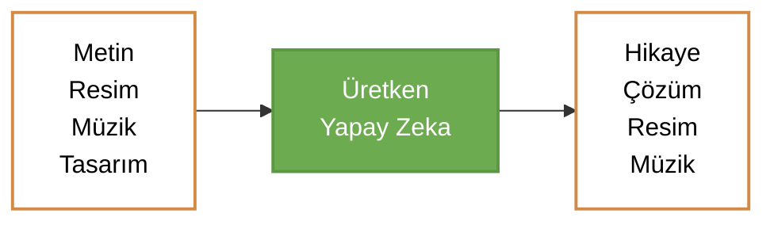

## Giriş

Üretken Yapay Zeke (Generative AI), metin, görsel, ses ve sentetik veri gibi çeşitli içerik türlerini oluşturabilen bir yapay zeka teknolojisidir. Derin öğrenmenin bir alt kümesidir. GANs gibi algoritmaların ortaya çıkması ile gerçek insanların inandırıcı görüntüleri ve seslerini üretebilme yeteneği kazandırılmıştır. Film düblajları, eğitim içerikleri gibi pek çok alanda işlerin kolaylaştırılmasını sağlarken deepfake (Derin Sahte, gerçek ve sahta ayrımı yapılması çok zor olan zararlı içerikleri adlandıran kavaram) gibi problemleri ortaya çıkarmıştır. Doğruluk ve önyargı sorunları vardır. Gelecek potansiyeli ise çok yüksektir. 

## Çalışma Şekli

Girdilerileri daha öncesinden öğrendiği bilgiler ile harmanlayarak yeni çıktılar üretmektedir. Bu bir üretken yapay zeka sürecidir. Bu sireçteki en önemli nokta ise **Etik ve Güvenlik** sorunlarıdır.

## Kullanım Alanları
- Müşteri Hizmertleri
- Teknik Destek
- Deepfake (Zarlı bir aladır. Hukuki sorunlar ouluşturur.)
- Dil Çevisi ve Dublaj
- Metin Oluşturma
- Sanat Eseri Oluşturma
- Ürün Tanıtımı
- İlaç Tasarmı
  - Yeni ilaç bileşenleri önerme.
- Mimarlık ve Tasarım
- Çip Tasarımı
- Müzik Oluşturma

## Avantajları

- İşletmelerde pek çok alanda kullanılabilir.
- Var olan içerikleri yorumlamayı ve anlamatı kolaylaştıurabilir.
- İçerik yazma sürecini otomatikleştirebilir.
- E-posta yanıt verme çabasını azaltabilir.
- Belirli teknik sorunlara daha iyi yanıt verebilir.
- Gerçekçi insan temsilleri oluşturabilir.
- Karmaşık bilgileri tutarlı bir anlatıya özetleyebilir.
- Belirli bir tarzda içerik oluşturma sürecini basitleştirebilir.

Kısaca bir çalışanın gün içerisinde yaptıkları işleri kolaylaştırması olarak özetlenebilir.

## Araçları

- Metin Oluştrma Araçları
  - GPT
  - Jasper
  - AI-Writer
  - Lex
- Görüntü Oluşturma Araçları
  - Dall-E 2
  - Midjourney
  - Stable Diffusion
- Müzik Oluşturma Araçları
  - Amper
  - Dadabots
  - MuseNet
- Kod Oluşturma Araçları
  - CodeStarter
  - Codex
  - GitHub Copilot
  - Tabnine
- Ses Sentezi
  - Descript
  - Podcast.ai

## Sektörlere Göre Kullanım Alanları

- Finans
  - Müşterinin geçmişleri ile ilgili verileri incelemek ve dolancıların önüne geçmek için uygulanabilir.
- Huhuk
  - Sözleşmeleri tasarlamak, kanıt analizi yapmak, argümanları önermek ve uzun dökümanları özetlemek için kullanılabilir.
- Üretim
  - Kamere, X-Işını gibi görünrülerden kusurları görüntülemek için kullanılabilir.
- Film ve Media
  - İçerik üretimi, medya üretimi, ses üretimi vb. kullanım alanlarında yer alabilmektedir.
- Sağlık
  - Umut vadeden ilaçların üretiminde ve keşfedilmesinde kullanılmaktadır.
- Mimarlık
  - Hızlı bir şekilde prototipleme sağlar
- Oyunlar
  - Tasarım, yapay zeka karakterlerin oluşturulmasında kullanılır.

## Etik ve  Önyargı

- Güvenilirlik ve Doğruluk
  - Verdiği cevapların güvenilir ve doğru olup olmadığı. Ön yargılar la cevap verip vermediği. İntihal ortaya çıkaracak sonuçlar oluşturması vb pek çok konuda hala güvenilir bir ortam oluşturamamıştır.
- İçeriğin Gerçekçiliği ve Algılama Güçlüğü
  - Üretilmiş içeriğin doğruluğu ve yanlışların fark edilmesini de zorlaştırmakta.
- Şeffaflık Sorunu
  - Neden o sonucu ürettiğini bilmediğimizden, telif haklkı vb. sorunlar oluşturmakta.
- 

## Gelenelksel AI ve Üretken AI

|                     | TAI                                                                                                | GAI                                                                                    |
| ------------------- | -------------------------------------------------------------------------------------------------- | -------------------------------------------------------------------------------------- |
| Özellikler          | Yenilikçi içerik oluşturma.                                                                        | Kurtal tabanlı işleme.                                                                 |
| Kullanım Teknikleri | Transformer, Generative adversarial networks (GAN), Variational autoencoders (VAE)                 | Evrişimli sinir Ağları (CNN), Yinelemeli sinir ağları (RNN), Pekiştirmeli öğrenme (RL) |
| Başlangıç İstekleri | Başlangıç isteğiyle çalışır, kullanıcının veya veri kaynağının içeriği yönlendirmesine izin verir. | Önceden belirlenmiş bir dizi kuralı takip eder.                                        |
| İşlem Türleri       | Doğal dil işleme, görsel içerik oluşturma, müzik üretimi, deepfake oluşturma                       | Veri sınıflandırma, tahminleme, optimizasyon, örüntü tanıma                            |
| Örnekler            | DALL-E, ChatGPT, MuseNet                                                                           | ResNet LSTM SVM K-Means                                                                |

## Üretken Yapay Zeka'nın Geleceği

- Daha ileri derin öğrenme modelleri.
- Daha iyi genelleme yetenekleri.
- Daha insansı etkileşimler.
- Endüstriyel uygulamalar.
- Yeni yaratıcı alanlar.

## Kimler Tarfından Yapıdı

Joseph Weizenbaum 1960 da ELIZA sohbet botu ile temeli atıldı. Ian Godfellow 2014 de GAN'ları gösterdi. OpenAI ve Google tarafından LLM'lere dönüşen  ChatGPT, Google Bard ve DALL-E gibi araçlar ortaya atıldı. 

## İşlerimizi Nasıl Etkiler

- Ürün açıklamaları yazma.
- Pazarlama metinleri oluşturma.
- Web içerik üretme.
- Etkileşimli satış iletişimi başlatma.
- Müşteri sorularını yanıtlama.
- Web sayfalar için grafik oluşturma.

## Bazı Üretken Modeller

- XLNet
- GPT
- ALBERT
- LaMDA
- Gemini
- DeepSeek

## Prompt

Modelin belirli bir görevi veya sorunu çözmek için bir giriş formatı veya talimatıdır. 

- Few-Shut Prompting (Az Çekimli Yönlendirme)
  - Modelin sınırlı sayıda örnekle bir görevi öğrenmesini sağlamak için kullanılan propmting yöntemidir.
- Role Prompting (Rol Yönlendirme)
  - Modelin bir metin parçasındaki bellirli bir rolü veya ilişkiyi tanımasına, çıkarım yapasına olanak tanıyan yöntemdir.
- Language Prompting (Dil Yönlendirme)
  - Modelin belirli bir dilde metin oluşturmasını veya anlamasını sağlamak için kullanılan yöntemdir. Dil kurallarını anlamamasına ve doğru bir şeklide yorumlama ve yeni içerik üretmesine yardımcı olmaktadır.
- Task Prompting (Görev Yönlendirme)
  - Modelin belirli bir görevbi yerine getirmesini sağlamak için yapılan yönendirme yöntemidir.
- Structured Prompting (Yapısal Yönlendirme)
  - Modelin belirli bir yapıya ya da format içerisinde metin oluışturmasını ve anlamasını istenmesini oluşturan yöntemdirç

### Prompt Tabanlı Öğrenme  

Doğal dil işleme modellerini eğitmek veya ayarlamak için kullanılan bir yöntemdir. Bu yöntemde, modele verilen girişlerin başına özel talimatlar eklenir. Bu talimatlar, modele ne tür bir çıktı üretmesi gerektiğini belirtir. Model, bu talimatları dikkate alarak istenilen görevi veya çıktıyı üretmeye çalışır.

#### Prompt Mühendisliği

Doğal dil işleme modellerini eğitmek veya ayarlamak için promptların oluşturulması ve optimize edilmesi sürecidir.